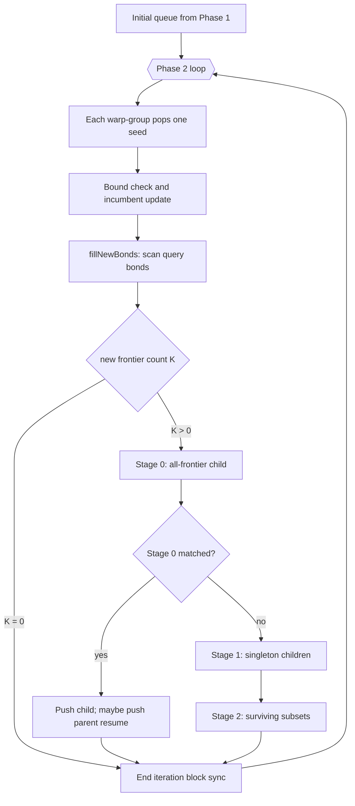
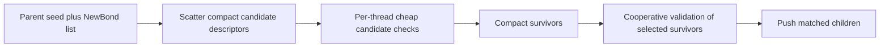

# fMCS Parallelization Work Plan

This note prepares incremental work on the CUDA fMCS grow loop. It focuses on
the main loop after initial seeding and before result writeback.

The goal of this plan is CTA efficiency, not multi-CTA tail saturation. The
near-term objective is to get substantially more useful work out of the one CTA
that already owns a molecule pair. That has two parts:

1. General per-candidate performance work: make the existing warp-group work
   cheaper without changing the execution model.
2. Intra-CTA decoupling work: split cheap candidate generation and filtering
   across lanes/threads, then recombine surviving descriptors for cooperative
   validation.

Multi-CTA execution is a separate later problem. It may become easier after the
descriptor work below, but it is not the focus of this plan.

## Source Map

- Main kernel and Phase 2 grow loop:
  `src/mcs/fmcs_cuda/fmcs_kernel.cuh`
- Seed state, match state, and scalar seed helpers:
  `src/mcs/fmcs_cuda/fmcs_seed.cuh`
- Frontier bond enumeration and grow helpers:
  `src/mcs/fmcs_cuda/fmcs_grow.cuh`
- Incremental and fallback substructure matching:
  `src/mcs/fmcs_cuda/fmcs_match.cuh`
- Queue reservation and storage model:
  `src/mcs/fmcs_cuda/fmcs_seed_queue.cuh`
- Warp and block copy helpers:
  `src/mcs/mcs_common/mcs_cooperative_copy.cuh`
- Existing timing/stat analysis:
  `analysis/mcs_1k_timing_analysis/summary.md`
  `analysis/mcs_1k_timing_analysis/fmcs_stats_parallelism_summary.json`

## Current Execution Shape

- One CUDA block owns one molecule pair.
- The block is split into 32-thread warp-groups.
- Each warp-group can pop and grow one seed per Phase 2 iteration.
- The shared queue is a per-block LIFO worklist backed by global memory.
- The block synchronizes at the end of each Phase 2 iteration before checking
  timeout and queue-empty state.
- Most candidate construction is serial within a warp-group. Some matching
  scans are lane-parallel.



## Baseline Observations

Existing stats show runtime tracks search work counters more strongly than
input size alone:

- `match_calls`, `fallback_calls`, `popped`, and `phase2_iters` have Spearman
  correlations around 0.95 or higher with nvMolKit time in the stats dataset.
- The slow outlier pair 851 has about 20k popped seeds, 10k Stage 2 attempts,
  about 24k fallback calls, and about 18k fallback failures depending on block
  size.
- Increasing warp-groups per block improves the outlier, which suggests there
  is useful inter-seed parallelism, but the search is still constrained by
  single-block-per-pair scheduling and serial work inside each candidate.
- The outlier's in-block queue is not obviously starving warp-groups. In the
  64/128/256/512-thread experiments, each group popped work in almost every
  Phase 2 iteration. The speedup from 128 to 512 threads was about 2.2x from
  4x more warp-groups, so the current work is parallel but not efficiently
  parallel.
- The 512-thread path is experimental, and the larger tier128 kernel variant
  exceeded the static shared-memory limit. Treat 512 as a hard-case experiment,
  not a general default.

These observations make two classes of work attractive:

1. Reduce repeated serial per-candidate overhead.
2. Increase useful per-candidate or per-parent thread-level work inside the
   existing CTA before considering any multi-CTA implementation.

## Work Vocabulary

Use these symbols when discussing complexity:

- `Qb`: query bond count.
- `Qa`: query atom count.
- `Tb`: target bond count.
- `Ta`: target atom count.
- `Sa`: atoms in the current seed.
- `Sb`: bonds in the current seed.
- `K`: frontier `NewBond` count from `fillNewBonds`.
- `Kp`: surviving frontier count after Stage 1 pruning.
- `P`: current fallback partial count at one substructure-search depth.
- `G`: warp-groups per block, usually `blockSize / 32`.

## Current Parallelism Quality

| Step | Work | Current parallelism | Effectiveness |
| --- | --- | --- | --- |
| Queue pop/push | O(1) CAS plus `QueuedSeed` copy | Lane 0 reserves, warp copies | Low. This is cooperative data movement. |
| Incumbent update | O(1) CAS plus optional copy | Lane 0 score/lock, warp copies | Low. Necessary coordination, not search parallelism. |
| Remaining-size bound | Roughly reachable atoms times `Qb` | Lane 0 only, followed by group sync | Poor. Repeated often. |
| `fillNewBonds` | O(`Qb`) scan | Lanes split query bonds | Good when `Qb` is large enough. |
| Stage 0 child patch | O(`K`) | Lane 0 only after warp copy | Poor, but usually small. |
| Stage 1 enumeration | O(`K`) children | Serial over `K`; match may use lanes | Shallow. |
| Stage 2 enumeration | About `2^Kp - 1 - Kp` subsets | Serial over subset compositions | Poor at enumeration level. |
| Fast incremental match | O(unmapped seed bonds times `Tb`) | Lanes split target bonds per query bond | Good scan parallelism, serial over query bonds. |
| Fallback prepare/rebuild | O(seed and target setup) | Lane 0 only | Poor. |
| Fallback expansion | Data-dependent partial expansion | Lanes split candidate target atoms | Mixed. Real lane work, but partial loop is serial. |

## Problem Separation

Do not conflate these three efforts. They solve different bottlenecks.

| Class | What changes | Applies to | Does not solve |
| --- | --- | --- | --- |
| General per-candidate performance | The same warp-group owns the same candidate, but individual helpers do less work or use lanes better. | Broad p50/p95/p99 improvement and lower cost for hard cases. | One hard pair still occupies one CTA. |
| Intra-CTA decoupling | Threads generate or prefilter compact candidate descriptors; warp-groups validate only survivors. | Cases with serial enumeration, cheap rejects, fallback setup, or bound work before expensive validation. | Global tail saturation; still one CTA per pair. |
| Multi-CTA execution | Many CTAs cooperate on one hard pair through global work queues and a global incumbent. | Final-batch tail utilization after one hard pair remains. | Per-candidate inefficiency; may amplify imbalance if candidates are not already decoupled. |

This file focuses on the first two rows. Multi-CTA execution should be treated
as a later consumer of the descriptor/decoupling work, not as the next immediate
optimization.

### General per-candidate performance

This keeps the current ownership model:

```text
one molecule pair -> one CTA
one seed/candidate -> one warp-group
warp-group expands, matches, falls back, and pushes children
```

Examples:

- adjacency scans in fast incremental match,
- exact parallel remaining-size computation,
- cheaper fallback preparation,
- conservative Stage 1 prefilters,
- hard-case block-size selection within viable resource limits.

This is the safest path to reduce total runtime. It should be pursued before a
large scheduling redesign because it lowers the work that any later scheduler
would have to perform.

### Intra-CTA decoupling

This changes the pipeline inside the block but still keeps one block per pair:

```text
parent seed -> many cheap descriptors -> compact survivors -> cooperative validation
```

The point is not to let a single thread solve a candidate. The point is to stop
spending a whole warp-group on work that can be cheaply enumerated, rejected, or
prepared by independent lanes. Surviving candidates still return to cooperative
validation so full seed state, fallback scratch, and mapping state stay explicit
and bounded.

This applies if counters show time in:

- serial Stage 1 or Stage 2 candidate enumeration,
- repeated remaining-bound checks,
- fallback preparation before expansion,
- cheap singleton/subset rejects before full match,
- queue copies of candidates that are later discarded quickly.

It is less useful when most time is already spent in real fallback expansion or
full cooperative validation for candidates that cannot be cheaply rejected.

### Multi-CTA execution

This is intentionally deferred in this plan. It attacks the H200 utilization
tail by letting many CTAs work on one molecule pair. It will still have
diminishing returns from global queue contention, incumbent propagation,
duplicate speculative work, and termination detection.

The reason to defer it here is not that it is unimportant. It is that multi-CTA
work benefits from the same compact candidate descriptors needed for intra-CTA
decoupling. If we first separate candidate generation/filtering from validation,
then a later global queue can move compact descriptors instead of full
`QueuedSeed` state.

## Incremental Work Items

### 1. Use adjacency scans in fast incremental match

Category: general per-candidate performance.

Current shape:

- `matchIncrementalFastCooperative` scans all target bonds for each unmapped
  query bond.
- In the atom-adding case, one target endpoint is already known, so the scan
  can use `targetRowOffsets` and `targetColIndices` to inspect only incident
  target atoms or bonds.

Expected effect:

- Reduces wasted `Tb` scans, especially for larger targets with low degree.
- Does not change queue semantics or grow-stage order.
- Should reduce fast-match work and may reduce fallback pressure if fast match
  reaches the same answers faster.
- This does not create new search parallelism. It makes the existing
  warp-group validator cheaper.

Main correctness constraints:

- Preserve the existing first-compatible-target behavior as much as possible.
  If ordering changes, verify that output size and valid mappings remain
  equivalent across tests.
- Ring-closing still needs a bond lookup between two mapped target atoms.
- Bond-label compatibility must still be checked through match tables.

Validation:

- Unit tests: `FMCSUnit` incremental match tests.
- Integration tests: `test_fmcs`, `test_fmcs_integration`.
- Python MCS tests if the Python package is rebuilt.
- Compare stats on the 1k timing dataset and outlier pair 851.

Risk:

- Low to medium. The main risk is changing which witness embedding is kept.

### 2. Parallelize or cheapen remaining-size computation

Category: general per-candidate performance with local lane parallelism.

Current shape:

- `seedComputeRemainingSizeRdkitCooperative` is cooperative in name only.
- Lane 0 computes a connectivity-aware remaining bound and the group waits.
- It runs before Stage 0, every Stage 1 child, and every Stage 2 subset.

Option A: exact parallel version

- Keep the same bound semantics.
- Use group lanes to scan query bonds and update local frontier/visited state.
- Coordinate frontier iterations with group syncs.

Option B: cheaper conservative bound

- Use a looser bound that never rejects a seed that could still beat the
  incumbent.
- This is safe for correctness but may increase search work if too loose.

Expected effect:

- Option A reduces repeated single-lane work.
- Option B can be simpler and faster if the looser bound does not explode the
  queue.
- This is an efficiency optimization inside the existing CTA. It does not
  change queue ownership or candidate scheduling.

Main correctness constraints:

- The bound may only reject when no growth can beat the incumbent.
- If exactness changes, treat it as a pruning-policy change and compare search
  counters carefully.

Validation:

- Compare `numCommonVertices`, `numCommonEdges`, timeout, and overflow flags
  against baseline.
- Track `bound_rejected`, `popped`, `stage2_attempts`, and total time.
- Include hard cases with rings and high MCS fraction.

Risk:

- Medium. A too-tight incorrect bound is a correctness bug. A too-loose bound is
  safe but can regress runtime.

### 3. Parallelize fallback preparation where it is local

Category: general per-candidate performance with local lane parallelism.

Current shape:

- `prepareSeedSubstructureSearchWithinThread` clears scratch, computes degrees,
  chooses query atom order, and counts candidates on lane 0.
- The later fallback expansion uses lanes, but setup and rebuild are serial.

Candidate local changes:

- Parallel clear of scratch arrays.
- Parallel target-degree accumulation if done with small atomics or a
  deterministic two-pass scheme.
- Parallel candidate-count calculation for each query atom considered by the
  ordering heuristic.

Expected effect:

- Reduces cost per fallback call. This matters because fallback calls correlate
  strongly with time.
- This is especially important if new counters show fallback setup/rebuild is a
  large fraction of total fallback time. If fallback expansion dominates,
  setup parallelization alone will not be enough.

Main correctness constraints:

- Preserve query ordering tie-breaks unless deliberately changing and measuring
  them.
- Avoid per-thread local arrays for degrees or mappings.
- Keep scratch placement explicit. Shared memory is acceptable for bounded
  per-group scratch; scalable partial bodies should remain in global memory.

Validation:

- Fallback-specific unit tests in `test_fmcs_unit.cu`.
- Stats: `fallback_calls`, `fallback_success`, `fallback_fail` should remain
  comparable. Time per fallback should improve.
- Build resource reports must show no stack and no spills for production code.

Risk:

- Medium. The work is local, but the fallback matcher has many hidden ordering
  assumptions.

### 4. Add Stage 1 cheap prefiltering

Category: boundary between general performance and intra-CTA decoupling.

Current shape:

- Stage 1 loops over `K` new bonds serially.
- For each alive bond, it copies the parent, patches one bond, recomputes the
  remaining bound, and calls full match.

Candidate local change:

- Before full singleton construction, run a lane-parallel viability pass over
  `K` frontier bonds.
- Reject only impossible singletons, for example no compatible target bond or
  no compatible atom candidate under known mapping constraints.

Expected effect:

- Reduces expensive full child construction and fallback calls.
- Does not require changing queue storage.
- This is the smallest useful version of descriptor-style decoupling: reject
  impossible singleton candidates before constructing full child state.

Main correctness constraints:

- The prefilter must be conservative. False negatives are correctness bugs.
- Failed full singleton matches currently set `alive = false` and affect Stage
  2. A cheap prefilter may only mark `alive = false` when it proves the same
  impossibility as full matching would.

Validation:

- Stage 1/Stage 2 counter deltas are expected.
- Final MCS outputs must match baseline.
- Pay special attention to ring-closing and label-matching cases.

Risk:

- Medium. Good payoff if many singleton children are impossible, but proving
  the filter is conservative is the hard part.

### 5. Prototype descriptor scatter and gather inside one CTA

Category: intra-CTA decoupling.

This is the "break warp work into threads, then recombine for validation" path.
It is not multi-CTA execution. The molecule pair still belongs to one block,
but the block stops treating every possible child as a full warp-group-owned
candidate from the beginning.

Proposed shape:



Candidate descriptor:

```text
parent queue slot or workspace id
stage kind: singleton or subset
composition bitmask over NewBond list
predicted added atom count
predicted added bond count
cheap viability flags
```

Why descriptors first:

- A full `QueuedSeed` is too large to multiply per thread.
- Per-thread full `MatchResult` or fallback scratch would likely create local
  memory, spills, or too much shared memory.
- Compact descriptors allow real thread-level filtering while preserving the
  current cooperative matcher for the expensive cases.
- The same descriptor representation can later feed a multi-CTA queue, but the
  first implementation should remain single-CTA so the efficiency effect is
  isolated.

Validation options after scatter:

1. Keep one cooperative validator per warp-group.
   - Lowest risk.
   - Threads parallelize candidate filtering, then the group validates
     survivors serially.
2. Use sub-warp validators.
   - More true parallel validation.
   - Requires multiple scratch slices and careful occupancy accounting.
3. Let threads run only cheap incremental checks, then enqueue fallback-needed
   candidates for cooperative validation.
   - Likely best long-term compromise.

Risk:

- High relative to items 1-4. This changes the candidate pipeline and scratch
  model.

Applicability:

- Strong if many generated singleton/subset candidates fail cheap structural or
  label constraints before full validation.
- Strong if fallback preparation is frequently reached and can be separated
  from fallback expansion.
- Weak if almost every surviving descriptor needs full fallback expansion and
  there are few cheap rejects.
- Still limited by one CTA per pair. This can reduce total work or improve lane
  utilization, but it cannot by itself make a final single pair occupy the
  whole H200.

## Suggested Order

1. Add enough counters to separate validation work from pre-validation work:
   fallback setup vs fallback expansion, Stage 1/Stage 2 cheap rejects, bound
   time/count, and per-warp-group work distribution.
2. Fast-match adjacency scan.
3. Remaining-size exact parallelization. Avoid a looser bound until exact
   parallelization has been measured, because extra popped seeds can worsen the
   slow tail.
4. Fallback preparation parallelization if counters show setup/rebuild is a
   meaningful part of fallback time.
5. Stage 1 cheap prefilter as the first small descriptor-style decoupling
   experiment.
6. Descriptor scatter/gather prototype for Stage 2 subsets inside one CTA.

This order keeps early work local and measurable. It also avoids building a
larger scatter/gather design on top of obvious serial costs that can be removed
first. Multi-CTA work is deliberately not in this order; the prerequisite is a
compact descriptor pipeline that makes candidate work movable without copying
full seed state.

The hoped-for 10x improvement will probably not come from one change. The
plausible path is multiplicative: reduce target scans, reduce repeated
single-lane bounds, reduce fallback setup, reject cheap candidates earlier, and
keep more lanes useful before expensive cooperative validation.

## Measurement Plan

Run every change against both correctness tests and search-shape counters.

Correctness checks:

- C++ unit tests for FMCS helpers.
- C++ integration tests for FMCS.
- Python MCS tests after rebuilding the Python extension when relevant.
- Compare result sizes and mapping validity against baseline.

Performance counters to collect:

- `phase2_iters`
- `popped`
- `seed_checks`
- `match_calls`
- `match_found`
- `bound_rejected`
- `stage0_attempts`
- `stage1_attempts`
- `stage2_attempts`
- `fast_attempts`
- `fast_success`
- `fallback_calls`
- `fallback_success`
- `fallback_fail`
- `max_queue`
- fallback setup calls and time/cycles
- fallback expansion calls, depth, partial-count totals, and max partial count
- fallback rebuild calls and time/cycles
- Stage 1 cheap-prefilter pass/fail counts once that filter exists
- Stage 2 descriptor counts, cheap-reject counts, and validation counts once
  descriptor scatter exists
- per-warp-group popped count, validation count, fallback count, and active
  cycle estimate for hard cases

Datasets:

- Known outlier pair 851.
- The existing 1k Enamine pair sample with stats.
- A small labeled subset to catch label-table regressions.
- Ring-heavy and high-MCS-fraction cases from the slow tail.

Acceptance criteria:

- No correctness regression.
- No new overflow or timeout on baseline cases.
- No production ptxas stack frame or spills.
- Register/shared-memory changes are documented per kernel variant.
- Runtime improvement is visible on at least one targeted class without a broad
  p50/p95 regression.

## Resource And Storage Rules

- Do not add sizable local arrays in kernels or device helpers.
- Keep full `QueuedSeed`, match state, queues, and partial bodies in explicit
  shared or global storage.
- For new per-candidate state, prefer compact descriptors over full seed
  copies.
- If adding more shared scratch, compute per-block shared memory and expected
  occupancy for 64, 128, and 256 thread blocks.
- If adding global scratch, size it per pair and per group, and keep the memory
  budget safe for 6 GB-class execution.
- Do not introduce device lambdas unless there is no clearer named-helper
  alternative.

## Sync Checklist

When changing a step, update the sync accounting:

- Queue reserve/pop: lane-0 CAS, `group.shfl`, `warpCopy`, `group.sync`.
- Incumbent update: lane-0 score CAS, lock CAS, optional `warpCopy`, two group
  syncs, block fence before unlock.
- `fillNewBonds`: init sync, append scan, count sync, clamp sync, return sync.
- Child construction: `warpCopy` sync, lane-0 patch, sync, remaining-bound
  sync.
- Fast match: per unmapped query bond, target scan, `group.ballot`,
  `group.shfl`, lane-0 commit, group sync.
- Fallback match: prepare sync/shfl, first-candidate sync, per-depth syncs,
  final rebuild or clear sync.
- Outer loop: two block syncs at the end of each Phase 2 iteration.

Any new scatter/gather phase should explicitly say whether it adds:

- group syncs inside one warp-group,
- block syncs across all groups,
- atomics to per-group scratch,
- atomics to the shared queue,
- or global-memory scratch writes.

## Open Design Questions

- Is preserving RDKit-like witness ordering required, or only preserving final
  MCS size and a valid mapping?
- How much looser can remaining-size pruning become before `popped` and
  `stage2_attempts` regress?
- Is the slow tail dominated by fallback setup, fallback expansion, repeated
  failed fallback attempts, or work before fallback is entered?
- For hard-case routing, is 256 threads broadly viable across tiers, and is
  512 only viable for smaller tier variants unless shared/global scratch is
  redesigned?
- Should the first scatter/gather prototype target Stage 1 only, or Stage 2
  subsets as well?
- What cheap descriptor fields predict a doomed candidate well enough to avoid
  constructing a full child seed?
- At what descriptor-survivor rate does scatter/gather stop paying for itself?

## First PR Shape

The first implementation PR should be intentionally small. It can be either
instrumentation or one local optimization:

- Add the missing CTA-efficiency counters, or pick one local optimization.
- Add or reuse a focused FMCS unit test that covers the touched helper.
- Run C++ FMCS tests.
- Collect before/after stats for outlier pair 851.
- Record ptxas resource output for affected kernel variants.
- Include the counter deltas in the PR description.

Do not combine adjacency scanning, remaining-bound changes, and fallback
preparation in one PR. They compose, but measuring them separately is the only
way to know which one actually helped.

Do not start with multi-CTA scheduling in this plan. First make candidate work
explicit and compact enough that the existing CTA uses its lanes effectively.
That is both the direct efficiency target and the cleanest prerequisite for any
future global scheduler.
