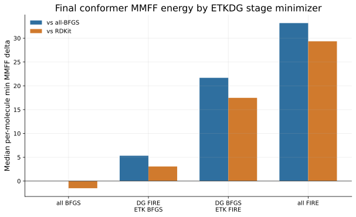
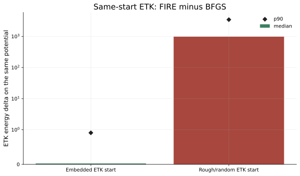
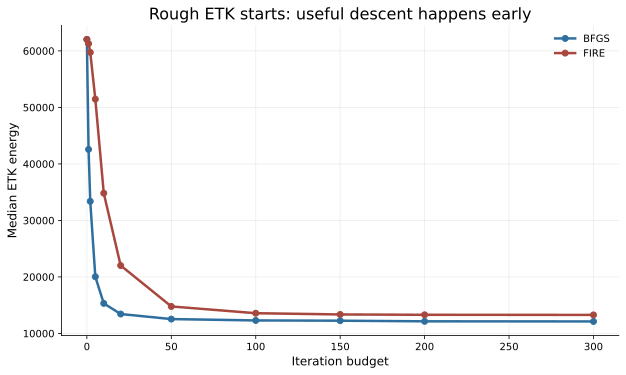
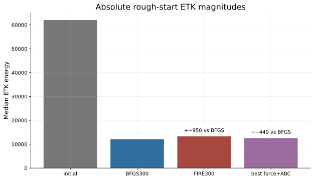
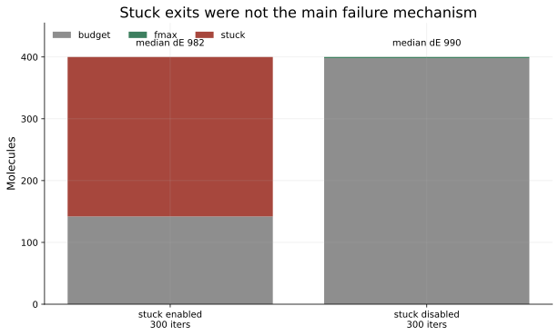
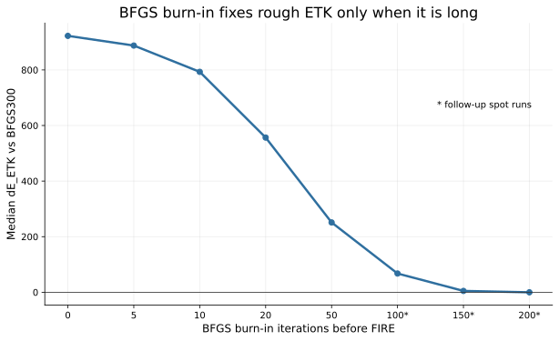
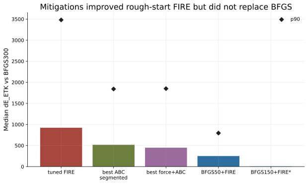

# FIRE in the ETKDG Conformer Pipeline

Date: 2026-06-09  
Branch context: experiments preserved on `fire_etkdg_experiments_20260609`; PR cleanup branch is `fire_etkdg_dg_fire_pr`.  
Pre-session checkpoint: `371171d` (`More work`). Local main merge-base for this work was `700cea4`.

## Executive Summary

The evidence points to a stage-specific result: FIRE is usable for the two distance-geometry minimization stages, but it is not a drop-in replacement for BFGS in the ETK 3D refinement stage.

In the full ETKDG pipeline, the damaging configuration was FIRE in the ETK stage. On the n=400 strided Enamine sample, the final conformer MMFF score shifted by +21.7 median per-molecule min-MMFF when only ETK used FIRE, and +33.2 when both DG and ETK used FIRE. Using FIRE only for DG and keeping ETK on BFGS was much closer at +5.3.

The mechanistic diagnostics explain that split. From embedded ETK starts, same-start FIRE and BFGS were near parity on the ETK potential: median dE_ETK was +0.024. From rough/random ETK starts, median dE_ETK was +980.8. That rough-start gap is not mainly an early stuck-exit artifact. Disabling stuck exits left the median rough-start gap essentially unchanged. FIRE continues to descend, but its state machine spends too much of the early rough phase in negative-power resets and collapsed time steps, while BFGS takes the large early descent quickly.

Recommended PR scope:

- ETKDG: use FIRE internally for the two DG minimization stages.
- ETKDG: keep the ETK 3D refinement stage on BFGS.
- ETKDG: do not expose a user-facing minimizer parameter.
- MMFF/UFF optimization: expose a `minimizerKind="BFGS" | "FIRE"` parameter.
- Exclude the DG/ETK batched-forcefield Python exposure, diagnostic debug-output hooks, and rough-start mitigation experiments from the PR.

## Full Pipeline Result

Experiment: n=400 molecules sampled by stride from `/home/kboyd/data/enamine_real_10M.cxsmiles`, seed 42, 10 conformers/molecule, ETK stage budget 300. Final quality metric was MMFF94 single-point energy, then per-molecule minimum over conformers. Deltas are yield-matched.



| Pipeline | Median min-MMFF vs all-BFGS | Median min-MMFF vs RDKit | Conformer yield | Embed seconds |
|---|---:|---:|---:|---:|
| RDKit | n/a | 0.0 | 1.000 | 34.5 |
| all BFGS | 0.0 | -1.5 | 0.952 | 30.5 |
| DG FIRE, ETK BFGS | +5.3 | +3.1 | 0.940 | 79.7 |
| DG BFGS, ETK FIRE | +21.7 | +17.5 | 0.934 | 23.6 |
| all FIRE | +33.2 | +29.4 | 0.906 | 77.1 |

Takeaway: full BFGS is healthy, and the stage-isolated sweep says the ETK stage is where FIRE causes the main final-geometry quality loss. DG-only FIRE is not free, but it is the only FIRE ETKDG integration point that stayed in the same ballpark.

## Same-Start Mechanism

The same-start ETK diagnostic minimized the ETK potential with FIRE and BFGS from identical starts, then recorded dE_ETK, fmax, dE_MMFF, and RMSD between final geometries.



| Start type | Median dE_ETK | p90 dE_ETK | Median RMSD FIRE/BFGS | Median FIRE-minus-BFGS fmax |
|---|---:|---:|---:|---:|
| Embedded ETK start | +0.024 | +0.91 | 0.054 | +0.049 |
| Rough/random ETK start | +980.8 | +3459.4 | 3.51 | +5.53 |

Interpretation:

- Embedded/local starts mostly rule out a generic FIRE forcefield or writeback bug.
- Rough starts expose the failure mode.
- The geometry divergence is large enough that even if the ETK energy gap is small relative to the initial descent, it can still land the molecule in a different geometry neighborhood.

## Rough-Start Dynamics

The dynamics diagnostic compared median ETK energy after fixed iteration budgets from the same rough starts.



Key medians:

| Budget | BFGS median ETK | FIRE median ETK |
|---:|---:|---:|
| 0 | 62027 | 62027 |
| 20 | 13432 | 22020 |
| 50 | 12536 | 14773 |
| 300 | 12120 | 13276 |

BFGS gets most of the useful descent in the first 20 to 50 steps. FIRE eventually closes much of the gap, but too slowly for the ETK stage budget. High-gap systems correlated with negative-power reset fraction and collapsed `dt`; initial fmax was not the dominant predictor.

Absolute scale matters:



The rough-start FIRE300 gap of about +951 ETK units is small compared with the initial-to-BFGS descent of about 50k ETK units, but it is still about 8% of the final BFGS energy scale and was coupled to multi-Angstrom RMSD shifts. The best non-BFGS mitigation reduced that median gap to about +449, still not enough to call it a replacement.

## Stuck Exit Check

We tested whether FIRE was stopping too early because the windowed energy-stagnation criterion was too aggressive.



For rough starts with tuned FIRE300:

- 258/400 exited by stuck criterion.
- 142/400 hit the iteration budget.
- 0/400 exited by fmax.
- Stuck exits had median exit step 208.

Disabling stuck exits did not fix the rough-start problem: rough-start FIRE-open300 still had median dE_ETK +989.8 vs BFGS300. BFGS polishing from FIRE recovered the median well, with FIRE300+BFGS300 at median +0.58, but the p90 remained +432.8. That points away from "stuck criterion exits too early" as the primary cause.

## Mitigations Tried



Short BFGS burn-in helped monotonically but not enough:

| Rough-start arm | Median dE_ETK vs BFGS300 | p90 |
|---|---:|---:|
| FIRE300 | +922.6 | +3481.1 |
| BFGS5 + FIRE | +887.7 | +2859.0 |
| BFGS10 + FIRE | +793.1 | +2369.2 |
| BFGS20 + FIRE | +556.6 | +1535.6 |
| BFGS50 + FIRE | +251.2 | +795.6 |
| BFGS100 + FIRE | +67.4 | not in primary artifact |
| BFGS150 + FIRE | +4.78 | not in primary artifact |
| BFGS200 + FIRE | -0.19 | not in primary artifact |

This explains why short BFGS burn-in was not a strong pipeline answer: it helps exactly the right failure mode, but it has to be long enough to do most of the rough-phase descent. At that point it is no longer a cheap FIRE replacement.



Other FIRE-side mitigations:

| Mitigation | Best observed median dE_ETK | p90 | Notes |
|---|---:|---:|---|
| Segmented ABC FIRE | +517.5 | +1841.6 | Better than tuned FIRE, still far from BFGS. |
| Force cap + ABC | +448.9 | +1850.6 | Marginal over ABC-only, mixed molecule-by-molecule effects. |
| FIRE rescue/restart after FIRE burn-in | worse than tuned FIRE | n/a | Did not address the early rough descent problem. |

ABC/restarts and force scaling reduce the rough-start gap by about half, but the remaining distribution is still too broad. The p90 stays around 1.8k ETK units.

## What Worked

- BFGS full ETKDG is a valid control. It was slightly better than RDKit by median final MMFF on this sample and had acceptable yield.
- FIRE matches BFGS closely on embedded/local ETK starts.
- DG-only FIRE with ETK BFGS is the least damaging ETKDG integration point found in the 2x2 stage sweep.
- BFGS burn-in works mechanistically when long enough, confirming the rough-start diagnosis.
- BFGS polish from FIRE shows many FIRE results are near a recoverable basin, but not all tails recover at the 300-step polish budget.

## What Did Not Work

- FIRE in the ETK stage as a direct BFGS replacement.
- Treating the tuned stuck-exit criterion as the root cause.
- Short BFGS burn-in as a cheap universal fix.
- FIRE-only ABC/restart/force-cap retuning as a complete replacement for the BFGS rough phase.
- Per-molecule aggregate averages as the main guide; the high-gap subset was the important signal.

## Final PR Shape

The PR branch should present this as a conservative production change:

- ETKDG uses FIRE only for DG minimization.
- ETKDG ETK refinement remains BFGS.
- ETKDG has no public minimizer selector.
- MMFF/UFF expose `minimizerKind` for direct forcefield minimization use cases.
- Experimental diagnostics stay on `fire_etkdg_experiments_20260609`.

Figure generation:

```bash
/home/kboyd/miniforge3/envs/rdcu_dev/bin/python docs/fire_etkdg_experiments/generate_figures.py
```

The generator reads the recorded summaries in `/tmp/etkdg_2x2_n400`, `/tmp/etk_same_start_diag`, `/tmp/etk_burnin_diag`, `/tmp/etk_fire_exit_mechanism`, `/tmp/etk_fire_dynamics`, `/tmp/etk_fire_abc_segment_sweep`, and `/tmp/etk_fire_force_abc_refine`.
